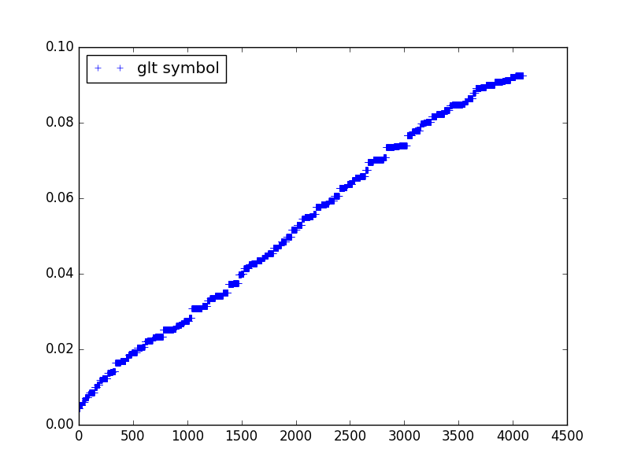

Dive into GLT
*************

Now, let's understand how it works.

Basis functions
^^^^^^^^^^^^^^^

We define our basis function using the letter **N**. the index **i** describe a
**test** function, while the index **j** stands for the **trial** function.

.. todo:: allow the user to define his own notation for the basis functions.

To define the derivatives, we use a suffix with the coordinate, so that **Ni_x**
stands for :math:`\partial_x N_i`.

Rules
^^^^^

The computation of the GLT symbol is done after applying some rules. These rules
are implemented as functions that act on the expression and make some changes on
tuplet of basis function.

You can print the expression through this process by setting the argument
**verbose=True**.::

  >>> expr = glt_symbol("Ni * Nj + Ni_x * Nj_x + Ni_y * Nj_y + Ni_z * Nj_z",
                        dim=3, discretization=discretization, evaluate=False,
                        verbose=True)
  Ni*Nj + Ni_u*Nj_u + Ni_v*Nj_v + Ni_w*Nj_w
  Ni1*Ni2*Ni3*Nj1*Nj2*Nj3 + Ni1*Ni2*Ni3_s*Nj1*Nj2*Nj3_s + Ni1*Ni2_s*Ni3*Nj1*Nj2_s*Nj3 + Ni1_s*Ni2*Ni3*Nj1_s*Nj2*Nj3
  m1*m2*m3 + m1*m2*s3 + m1*m3*s2 + m2*m3*s1

As any *sympy* expressions, you can print it in a **latex** form. However, you need
to use the **print_glt_latex** function::

  >>> from glt.expression import print_glt_latex
  >>> print_glt_latex(expr)

This should give the following result

.. math::

    \mathfrak{m}_p(\theta_1) \mathfrak{m}_p(\theta_2) \mathfrak{m}_p(\theta_3) + \mathfrak{m}_p(\theta_1) \mathfrak{m}_p(\theta_2) \mathfrak{s}_p(\theta_3) + \mathfrak{m}_p(\theta_1) \mathfrak{m}_p(\theta_3) \mathfrak{s}_p(\theta_2) + \mathfrak{m}_p(\theta_2) \mathfrak{m}_p(\theta_3) \mathfrak{s}_p(\theta_1)

This is what we are expecting.

.. todo:: reorder the print with respect to the index and not the letters.

Evaluating a symbol
^^^^^^^^^^^^^^^^^^^

Evaluation has two meanings:

1. symbolic computation of the symbol

2. computing the value for given numbers (int, float, complex)

We saw previously how to handle the first point. For the second one, you will need to **lambdify** your symbol. This must be done carefully, since you need to provide:

1. every constant that appears in your symbol

2. every function must be callable.

This can be done by calling **glt_symbol** with the additional arguments:

1. **user_constants**

2. **user_functions**

To make your symbol **callable** just run::

  >>> from glt.expression import glt_lambdify
  >>> s = glt_lambdify(expr, dim=3)

  >>> from numpy import pi
  >>> s(0.1, 0.1, 0.1, pi, pi, pi)
  0.0044450231481481502

Approximation of the eigenvalues
^^^^^^^^^^^^^^^^^^^^^^^^^^^^^^^^

The eigenvalues of the matrix associated to our weak formulation can be approximated by a uniform sampling of the GLT symbol::

  >>> from glt.expression import glt_approximate_eigenvalues
  >>> eig = glt_approximate_eigenvalues(expr, discretization)
  >>> import matplotlib.pyplot as plt
  >>> t = eig
  >>> t.sort()
  >>> plt.plot(t, "+b", label="glt symbol")
  >>> plt.legend(loc=2)
  >>> plt.show()

   Approximation of the eigenvalues of a (scalar) symbol using an uniform sampling. 

User constants and functions
^^^^^^^^^^^^^^^^^^^^^^^^^^^^

The following example shows how to deal with user defined functions and constants::

  >>> def h(x,y):
  >>>     return 1 + x**2 + y**2
  >>> 
  >>> discretization = {"n_elements": [16, 16], "degrees": [2, 2]}
  >>> 
  >>> txt  = "alpha * Ni * Nj + h(x,y) * Ni_x * Nj_x + beta * Ni_y * Nj_y"
  >>> expr = glt_symbol(txt, dim=2, \
  >>>                   verbose=False, evaluate=True, \
  >>>                   discretization=discretization, \
  >>>                   user_functions={'h': h}, \
  >>>                   user_constants={'alpha': 1., 'beta':1.e-3})
  >>> print expr
  (-32*cos(t1)/3 - 16*cos(2*t1)/3 + 16)*(13*cos(t2)/480 + cos(2*t2)/960 + 11/320)*h(x, y) + 0.001*(13*cos(t1)/480 + cos(2*t1)/960 + 11/320)*(-32*cos(t2)/3 - 16*cos(2*t2)/3 + 16) + 1.0*(13*cos(t1)/480 + cos(2*t1)/960 + 11/320)*(13*cos(t2)/480 + cos(2*t2)/960 + 11/320)

this symbol can be evaluated on a given point::

  >>> s = glt_lambdify(expr, dim=2)
  >>> s(0.1, 0.1, pi, pi)
  0.181580555556

As in the previous example, let's not *evaluate* the symbol::

  >>> expr = glt_symbol(txt, dim=2, \
  >>>                   verbose=False, evaluate=False, \
  >>>                   discretization=discretization, \
  >>>                   user_functions={'h': h}, \
  >>>                   user_constants={'alpha': 1., 'beta':1.e-3})
  >>> print expr
  alpha*m1*m2 + beta*m1*s2 + m2*s1*h(x, y)

Documentation
*************

.. automodule:: glt.expression 

.. currentmodule:: glt.expression

.. autofunction:: basis_symbols 
.. autofunction:: apply_mapping 
.. autofunction:: apply_tensor
.. autofunction:: apply_factor
.. autofunction:: glt_update_atoms 
.. autofunction:: glt_update_user_functions 
.. autofunction:: glt_update_user_constants 
.. autofunction:: glt_symbol 
.. autofunction:: glt_symbol_from_weak_formulation 
.. autofunction:: glt_lambdify 
.. autofunction:: glt_approximate_eigenvalues 
.. autofunction:: glt_plot_eigenvalues 
.. autofunction:: dict_to_matrix 
.. autofunction:: glt_symbol_laplace 
.. autofunction:: glt_integrate 
.. autofunction:: glt_formatting 
.. autofunction:: glt_formatting_atoms 

.. autoclass:: glt_symbol_m 
   :members:
   :private-members:
   :special-members:

.. autoclass:: glt_symbol_s 
   :members:
   :private-members:
   :special-members:

.. autoclass:: glt_symbol_a 
   :members:
   :private-members:
   :special-members:
