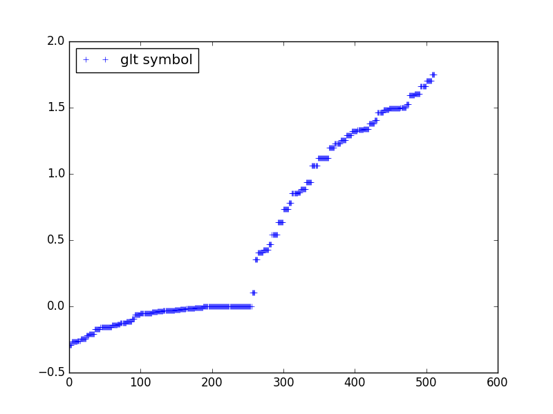
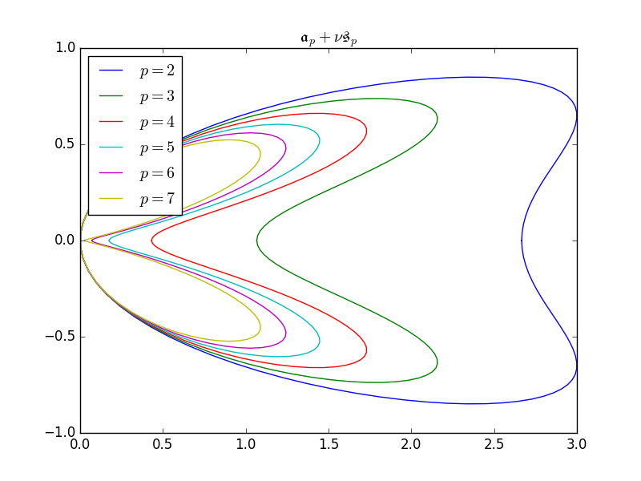
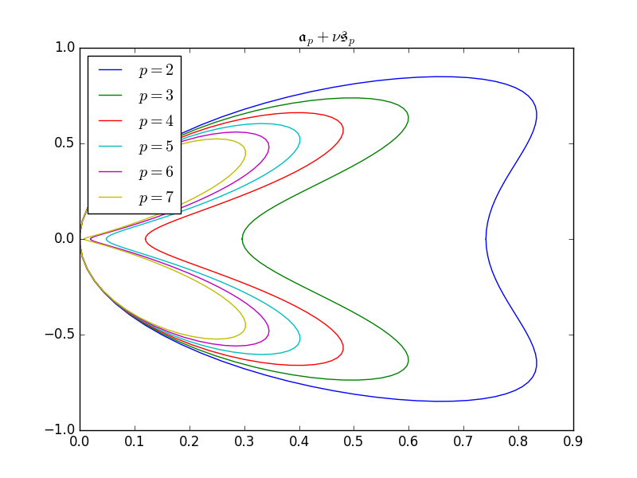
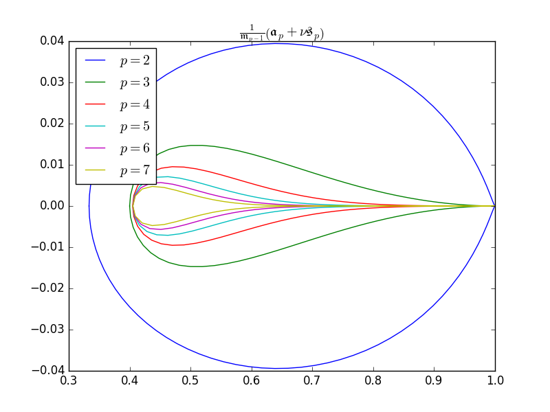
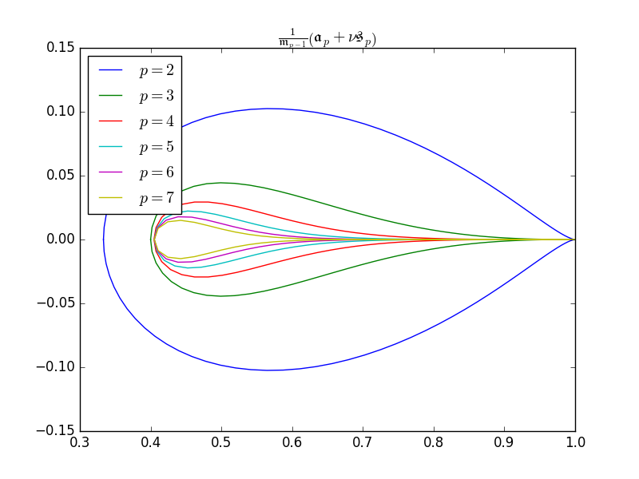
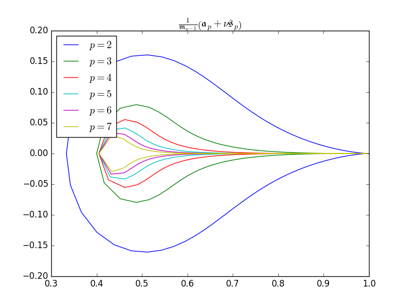

A first example
***************

Let us consider the following weak formulation

.. math::

    \int_{\Omega} N_i N_j + \nabla N_i \cdot \nabla N_j ~d\Omega

In the case where :math:`\Omega` is a cube, we should expect the GLT symbol

.. math::

    \mathfrak{m}_p(\theta_1) \mathfrak{m}_p(\theta_2) \mathfrak{m}_p(\theta_3) + \mathfrak{m}_p(\theta_1) \mathfrak{m}_p(\theta_2) \mathfrak{s}_p(\theta_3) + \mathfrak{m}_p(\theta_1) \mathfrak{s}_p(\theta_2) \mathfrak{m}_p(\theta_3) + \mathfrak{s}_p(\theta_1) \mathfrak{m}_p(\theta_2) \mathfrak{m}_p(\theta_3)

The following example constructs a glt symbol associated to a mass +
stiffness operator in 3D::

  >>> from glt.expression import glt_symbol
  >>> discretization = {"n_elements": [16, 16, 16], "degrees": [2, 2, 2]}
  >>> expr = glt_symbol("Ni * Nj + Ni_x * Nj_x + Ni_y * Nj_y + Ni_z * Nj_z", dim=3, discretization=discretization)

We get a *sympy* expression, that we can manipulate like any other *sympy*
expression. Let's print it::

  >>> print expr
  (-32*cos(t1)/3 - 16*cos(2*t1)/3 + 16)*(13*cos(t2)/480 + cos(2*t2)/960 + 11/320)*(13*cos(t3)/480 + cos(2*t3)/960 + 11/320) + (13*cos(t1)/480 + cos(2*t1)/960 + 11/320)*(-32*cos(t2)/3 - 16*cos(2*t2)/3 + 16)*(13*cos(t3)/480 + cos(2*t3)/960 + 11/320) + (13*cos(t1)/480 + cos(2*t1)/960 + 11/320)*(13*cos(t2)/480 + cos(2*t2)/960 + 11/320)*(-32*cos(t3)/3 - 16*cos(2*t3)/3 + 16) + (13*cos(t1)/480 + cos(2*t1)/960 + 11/320)*(13*cos(t2)/480 + cos(2*t2)/960 + 11/320)*(13*cos(t3)/480 + cos(2*t3)/960 + 11/320)

Good, but that's not readable for a human. You can now convert this expression to latex using::

  >>> from sympy import latex
  >>> latex(expr)

the result is the following formula

.. math::

    '\left(- \frac{32}{3} \cos{\left (t_{1} \right )} - \frac{16}{3} \cos{\left (2 t_{1} \right )} + 16\right) \left(\frac{13}{480} \cos{\left (t_{2} \right )} + \frac{1}{960} \cos{\left (2 t_{2} \right )} + \frac{11}{320}\right) \left(\frac{13}{480} \cos{\left (t_{3} \right )} + \frac{1}{960} \cos{\left (2 t_{3} \right )} + \frac{11}{320}\right) + \left(\frac{13}{480} \cos{\left (t_{1} \right )} + \frac{1}{960} \cos{\left (2 t_{1} \right )} + \frac{11}{320}\right) \left(- \frac{32}{3} \cos{\left (t_{2} \right )} - \frac{16}{3} \cos{\left (2 t_{2} \right )} + 16\right) \left(\frac{13}{480} \cos{\left (t_{3} \right )} + \frac{1}{960} \cos{\left (2 t_{3} \right )} + \frac{11}{320}\right) + \left(\frac{13}{480} \cos{\left (t_{1} \right )} + \frac{1}{960} \cos{\left (2 t_{1} \right )} + \frac{11}{320}\right) \left(\frac{13}{480} \cos{\left (t_{2} \right )} + \frac{1}{960} \cos{\left (2 t_{2} \right )} + \frac{11}{320}\right) \left(- \frac{32}{3} \cos{\left (t_{3} \right )} - \frac{16}{3} \cos{\left (2 t_{3} \right )} + 16\right) + \left(\frac{13}{480} \cos{\left (t_{1} \right )} + \frac{1}{960} \cos{\left (2 t_{1} \right )} + \frac{11}{320}\right) \left(\frac{13}{480} \cos{\left (t_{2} \right )} + \frac{1}{960} \cos{\left (2 t_{2} \right )} + \frac{11}{320}\right) \left(\frac{13}{480} \cos{\left (t_{3} \right )} + \frac{1}{960} \cos{\left (2 t_{3} \right )} + \frac{11}{320}\right)'

Let's work a little bit on this symbol; we first replace the variables
:math:`t_1, t_2, t_3` by :math`\theta_1, \theta_2, \theta_3` ::

  >>> from sympy import Symbol
  >>> names = {Symbol("t1"): "\theta_1", Symbol("t2"): "\theta_2", Symbol("t3"): "\theta_3"}
  >>> latex(expr, symbol_names=names)

which gives the result

.. math::

    \left(- \frac{32}{3} \cos{\left (\theta_1 \right )} - \frac{16}{3} \cos{\left (2 \theta_1 \right )} + 16\right) \left(\frac{13}{480} \cos{\left (\theta_2 \right )} + \frac{1}{960} \cos{\left (2 \theta_2 \right )} + \frac{11}{320}\right) \left(\frac{13}{480} \cos{\left (\theta_3 \right )} + \frac{1}{960} \cos{\left (2 \theta_3 \right )} + \frac{11}{320}\right) + \left(\frac{13}{480} \cos{\left (\theta_1 \right )} + \frac{1}{960} \cos{\left (2 \theta_1 \right )} + \frac{11}{320}\right) \left(- \frac{32}{3} \cos{\left (\theta_2 \right )} - \frac{16}{3} \cos{\left (2 \theta_2 \right )} + 16\right) \left(\frac{13}{480} \cos{\left (\theta_3 \right )} + \frac{1}{960} \cos{\left (2 \theta_3 \right )} + \frac{11}{320}\right) + \left(\frac{13}{480} \cos{\left (\theta_1 \right )} + \frac{1}{960} \cos{\left (2 \theta_1 \right )} + \frac{11}{320}\right) \left(\frac{13}{480} \cos{\left (\theta_2 \right )} + \frac{1}{960} \cos{\left (2 \theta_2 \right )} + \frac{11}{320}\right) \left(- \frac{32}{3} \cos{\left (\theta_3 \right )} - \frac{16}{3} \cos{\left (2 \theta_3 \right )} + 16\right) + \left(\frac{13}{480} \cos{\left (\theta_1 \right )} + \frac{1}{960} \cos{\left (2 \theta_1 \right )} + \frac{11}{320}\right) \left(\frac{13}{480} \cos{\left (\theta_2 \right )} + \frac{1}{960} \cos{\left (2 \theta_2 \right )} + \frac{11}{320}\right) \left(\frac{13}{480} \cos{\left (\theta_3 \right )} + \frac{1}{960} \cos{\left (2 \theta_3 \right )} + \frac{11}{320}\right)

To get a better printing, let's not run the evaluation of the atomic symbols (mass, stiffness, advection). This can be done by creating the glt symbol using the flag **evaluate=False**.::

  >>> expr = glt_symbol("Ni * Nj + Ni_x * Nj_x + Ni_y * Nj_y + Ni_z * Nj_z",
                        dim=3, discretization=discretization, evaluate=False)
  >>> print expr
  m1*m2*m3 + m1*m2*s3 + m1*m3*s2 + m2*m3*s1

Now, let's understand how it works.

**Basis functions**

We define our basis function using the letter **N**. the index **i** describe a
**test** function, while the index **j** stands for the **trial** function.

.. todo:: allow the user to define his own notation for the basis functions.

To define the derivatives, we use a suffix with the coordinate, so that **Ni_x**
stands for :math:`\partial_x N_i`.

**Rules**

The computation of the GLT symbol is done after applying some rules. These rules
are implemented as functions that act on the expression and make some changes on
tuplet of basis function.

You can print the expression through this process by setting the argument
**verbose=True**.::

  >>> expr = glt_symbol("Ni * Nj + Ni_x * Nj_x + Ni_y * Nj_y + Ni_z * Nj_z",
                        dim=3, discretization=discretization, evaluate=False,
                        verbose=True)
  Ni*Nj + Ni_u*Nj_u + Ni_v*Nj_v + Ni_w*Nj_w
  Ni1*Ni2*Ni3*Nj1*Nj2*Nj3 + Ni1*Ni2*Ni3_s*Nj1*Nj2*Nj3_s + Ni1*Ni2_s*Ni3*Nj1*Nj2_s*Nj3 + Ni1_s*Ni2*Ni3*Nj1_s*Nj2*Nj3
  m1*m2*m3 + m1*m2*s3 + m1*m3*s2 + m2*m3*s1

As any *sympy* expressions, you can print it in a **latex** form. However, you need
to use the **print_glt_latex** function::

  >>> from glt.expression import print_glt_latex
  >>> print_glt_latex(expr)

This should give the following result

.. math::

    \mathfrak{m}_p(\theta_1) \mathfrak{m}_p(\theta_2) \mathfrak{m}_p(\theta_3) + \mathfrak{m}_p(\theta_1) \mathfrak{m}_p(\theta_2) \mathfrak{s}_p(\theta_3) + \mathfrak{m}_p(\theta_1) \mathfrak{m}_p(\theta_3) \mathfrak{s}_p(\theta_2) + \mathfrak{m}_p(\theta_2) \mathfrak{m}_p(\theta_3) \mathfrak{s}_p(\theta_1)

This is what we are expecting.

.. todo:: reorder the print with respect to the index and not the letters.

**Evaluating a symbol**

Evaluation has two meanings:
    * symbolic computation of the symbol
    * computing the value for given numbers (int, float, complex)

We saw previously how to handle the first point. For the second one, you will need to **lambdify** your symbol. This must be done carefully, since you need to provide:
    * every constant that appears in your symbol
    * every function must be callable.

This can be done by calling **glt_symbol** with the additional arguments:
    * **user_constants**
    * **user_functions**

To make your symbol **callable** just run::

  >>> from glt.expression import glt_lambdify
  >>> s = glt_lambdify(expr, dim=3)

  >>> from numpy import pi
  >>> s(0.1, 0.1, 0.1, pi, pi, pi)
  0.0044450231481481502

**Approximation of the eigenvalues**

The eigenvalues of the matrix associated to our weak formulation can be approximated by a uniform sampling of the GLT symbol::

  >>> from glt.expression import glt_approximate_eigenvalues
  >>> eig = glt_approximate_eigenvalues(expr, discretization)
  >>> import matplotlib.pyplot as plt
  >>> t = eig
  >>> t.sort()
  >>> plt.plot(t, "+b", label="glt symbol")
  >>> plt.legend(loc=2)
  >>> plt.show()

.. figure:: include/examples/glt/ex3_approximate_eigen.png
   :scale: 50 %
   :alt: alternate text
   :figclass: align-center

   Approximation of the eigenvalues of a (scalar) symbol using an uniform sampling. 

User constants and functions
****************************

The following example shows how to deal with user defined functions and constants::

  >>> def h(x,y):
  >>>     return 1 + x**2 + y**2
  >>> 
  >>> discretization = {"n_elements": [16, 16], "degrees": [2, 2]}
  >>> 
  >>> txt  = "alpha * Ni * Nj + h(x,y) * Ni_x * Nj_x + beta * Ni_y * Nj_y"
  >>> expr = glt_symbol(txt, dim=2, \
  >>>                   verbose=False, evaluate=True, \
  >>>                   discretization=discretization, \
  >>>                   user_functions={'h': h}, \
  >>>                   user_constants={'alpha': 1., 'beta':1.e-3})
  >>> print expr
  (-32*cos(t1)/3 - 16*cos(2*t1)/3 + 16)*(13*cos(t2)/480 + cos(2*t2)/960 + 11/320)*h(x, y) + 0.001*(13*cos(t1)/480 + cos(2*t1)/960 + 11/320)*(-32*cos(t2)/3 - 16*cos(2*t2)/3 + 16) + 1.0*(13*cos(t1)/480 + cos(2*t1)/960 + 11/320)*(13*cos(t2)/480 + cos(2*t2)/960 + 11/320)

this symbol can be evaluated on a given point::

  >>> s = glt_lambdify(expr, dim=2)
  >>> s(0.1, 0.1, pi, pi)
  0.181580555556

As in the previous example, let's not *evaluate* the symbol::

  >>> expr = glt_symbol(txt, dim=2, \
  >>>                   verbose=False, evaluate=False, \
  >>>                   discretization=discretization, \
  >>>                   user_functions={'h': h}, \
  >>>                   user_constants={'alpha': 1., 'beta':1.e-3})
  >>> print expr
  alpha*m1*m2 + beta*m1*s2 + m2*s1*h(x, y)

Multilevel symbols
******************

Let's consider the following weak formulation, in 2D:

.. math::

  \int_{\Omega} \nabla v_1 \cdot \nabla u_1 + \partial_x v_1 \partial_y u_2 ~d\Omega = \ldots 
  \\
  \int_{\Omega} \partial_y v_2 \partial_x u_1 ~d\Omega  = \ldots 

where the trial function is :math:`(u_1, u_2)` while the test function is :math:`(v_1, v_2)` where every component leaves in a discrete subspace of :math:`H^1(\Omega)`.

In order to define the symbol, we use a dictionary as the following::

  >>> txt = {}
  >>> txt[1,1] = "Ni_x * Nj_x + Ni_y * Nj_y"
  >>> txt[1,2] = "Ni_x * Nj_y"
  >>> txt[2,1] = "Ni_y * Nj_x"

  >>> discretization = {"n_elements": [16, 16], "degrees": [2,2]}
  >>> expr = glt_symbol(txt, dim=2, \
  >>>                   verbose=False, evaluate=False, \
  >>>                   discretization=discretization)
  >>> print expr
  Matrix([[m1*s2 + m2*s1, -a1*a2], [-a1*a2, 0]])

As you can see, the result is a matrix (the symbol is then called a **multilevel** symbol).

You can print the associated *latex* code::

  >>> print_glt_latex(expr, mode="inline")
  
.. math::

  \left[\begin{smallmatrix}\mathfrak{m}_p(\theta_1) \mathfrak{s}_p(\theta_2) + \mathfrak{m}_p(\theta_2) \mathfrak{s}_p(\theta_1) & - \mathfrak{a}_p(\theta_1) \mathfrak{a}_p(\theta_2)\\- \mathfrak{a}_p(\theta_1) \mathfrak{a}_p(\theta_2) & 0\end{smallmatrix}\right]

In the case of a multilevel symbol, the eigenvalues of the previous matrix can be evaluated on a uniform grid, to get an approximation of the eigenvalues of the linear system associated to our weak formulation::

  >>> expr = glt_symbol(txt, dim=2, \
  >>>                   verbose=False, evaluate=True, \
  >>>                   discretization=discretization)

  .. note:: be sure to set **evaluate** to **True**. 

  >>> eig = glt_approximate_eigenvalues(expr, discretization)
  >>> t = eig
  >>> t.sort()
  >>> plt.plot(t, "+b", label="glt symbol")
  >>> plt.legend(loc=2)
  >>> plt.show()

   Approximation of the eigenvalues of a multilevel symbol using an uniform sampling. 

Examples
********

Convection-Diffusion in 1d
^^^^^^^^^^^^^^^^^^^^^^^^^^

Let us consider the following Convection-Diffusion problem in *1d*

.. math::

  \alpha \partial_x u - \nu  \partial_{xx} u = f(x), & \quad \Omega = ]0, L[ 
  \\
  u(0) = u(L) = 0 &

The weak formulation is

.. math::

  \int_{\Omega} \alpha v u_x + \nu v_x u_x ~d\Omega = \int_{\Omega} f v ~d\Omega

We now introduce the Péclet number 

.. math::

  P_e = \frac{\alpha h}{2 \nu}

where :math:`h` denotes the mesh step.

next, we consider :math:`L=1` and :math:`f(x) = 1` for which the analytical solution writes

.. math::

  u(x) = \frac{1}{\alpha} \left( x - \frac{1-e^{\gamma x}}{1-e^{\gamma}}  \right)

with :math:`\gamma = \frac{\alpha}{\nu}`

For our tests, we will be using :math:`\alpha = 1` and :math:`P_e \in \{ 0.25, 0.9, 5 \}` and :math:`h=0.1` which gives :math:`\nu \in \{ 0.2, \frac{1}{18}, 0.01 \}` and  :math:`\gamma \in \{ 5, 18, 100 \}` 

   GLT symbol for the 1d convection diffusion problem for different spline degrees on 10 elements and a Péclet number :math:`P_e = 0.25`. 

   GLT symbol for the 1d convection diffusion problem for different spline degrees on 10 elements and a Péclet number :math:`P_e = 0.9`. 

.. figure:: include/examples/glt/test_1d_10_Pe5.0.png
   :scale: 50 %
   :alt: alternate text
   :figclass: align-center

   GLT symbol for the 1d convection diffusion problem for different spline degrees on 10 elements and a Péclet number :math:`P_e = 5.0`. 

We recognize the typical high frequency pathology of the B-Splines. Let us now consider the symbol :math:`\frac{1}{\mathfrak{m}_{p-1}} \left( \mathfrak{a}_p + \nu \mathfrak{s}_p \right)` which corresponds to the convection diffusion linear system preconditioned with the usual GLT Toeplitz matrix.

   GLT symbol for the preconditioned (using the GLT Toplitz matrix) 1d convection diffusion problem for different spline degrees on 10 elements and a Péclet number :math:`P_e = 0.25`. 

   GLT symbol for the preconditioned (using the GLT Toplitz matrix) 1d convection diffusion problem for different spline degrees on 10 elements and a Péclet number :math:`P_e = 0.9`. 

   GLT symbol for the preconditioned (using the GLT Toplitz matrix) 1d convection diffusion problem for different spline degrees on 10 elements and a Péclet number :math:`P_e = 5.0`. 

We see now that the eigenvalues will be clustered far away from 0.

Documentation
*************

GLT Expression
^^^^^^^^^^^^^^

.. automodule:: glt.expression 

.. currentmodule:: glt.expression

.. autofunction:: basis_symbols 
.. autofunction:: apply_mapping 
.. autofunction:: apply_tensor
.. autofunction:: apply_factor
.. autofunction:: glt_update_atoms 
.. autofunction:: glt_update_user_functions 
.. autofunction:: glt_update_user_constants 
.. autofunction:: glt_symbol 
.. autofunction:: glt_symbol_from_weak_formulation 
.. autofunction:: glt_lambdify 
.. autofunction:: glt_approximate_eigenvalues 
.. autofunction:: glt_plot_eigenvalues 
.. autofunction:: dict_to_matrix 
.. autofunction:: glt_symbol_laplace 
.. autofunction:: glt_integrate 
.. autofunction:: glt_formatting 
.. autofunction:: glt_formatting_atoms 

.. autoclass:: glt_symbol_m 
   :members:
   :private-members:
   :special-members:

.. autoclass:: glt_symbol_s 
   :members:
   :private-members:
   :special-members:

.. autoclass:: glt_symbol_a 
   :members:
   :private-members:
   :special-members:

